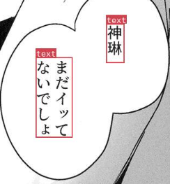
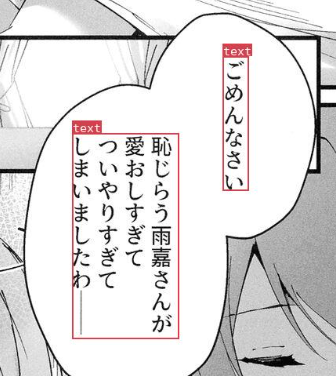
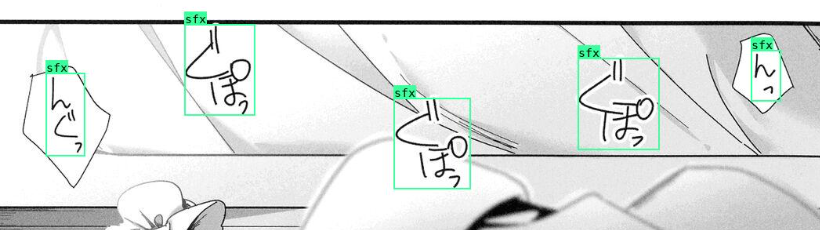
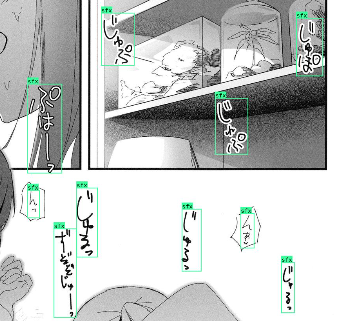
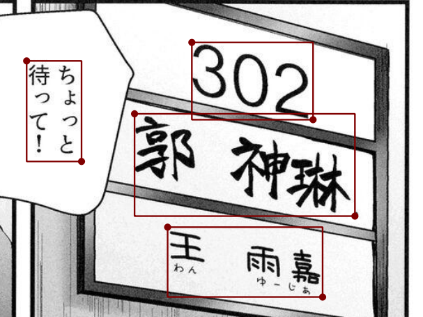

# Contribution Guide

## Step 1 - Clone this repo

## Step 2 - Choose a manga you are willing to annotate

Feel free to choose any manga that is able to be downloaded by `gallery-dl`. We accept both original version and translated version, and there is no requirement on langauge.

## Step 3 - Download

Download using `gallery-dl`. To maintain the directory structure, run the following command once you have installed `gallery-dl` through `pip`.

```bash
gallery-dl <url-to-download>
```

Here is the project page of `gallery-dl`: https://github.com/mikf/gallery-dl

To check whether the website you found is available, check out this documentation: https://github.com/mikf/gallery-dl/blob/master/docs/supportedsites.md

## Step 4 - Have the tool ready

Download [labelme](https://github.com/wkentaro/labelme).

You can either use `pip` to set up or just download the standalone.

## Step 5 - Annotate!

1. Open labelme and choose the directory
2. Start labelling.
3. Save the label at the same directory as the image.

What to be annotated?

* Text area bounding box, label them as `1`, use Rectangle tool
* Sound effects, label them as `2`, use Rectangle tool
* [Optional] Text lines, label them as `3`, use Polygon tool

Annotation Standard:

* The bbox should be as close to the text as possible
* Some words may look like sound effects, but they are actually text. Please annotate them as text.
* English in the manga should also be annotated
* Even though sometimes two text bubbles are close to each other or interconnected, they should still annotated separately.
* Sometimes in one text bubble, there may have multiple text areas. Please annotate them separately.
* Text line annotation is optional, as it is really labor intensive. But if you are willing to do it, please do it. It will be very helpful for the future research. For the text line annotation, please use polygon instead of bbox to annotation. The format should be similar to [MSRA-TD500 Dataset](http://www.iapr-tc11.org/mediawiki/index.php/MSRA_Text_Detection_500_Database_(MSRA-TD500))
* Here are some examples (Currently there are no examples for text lines).












## Step 6 - Add a `.link` at the directory of the manga

Create a file named `.link` at the directory of the manga, and put the link of the manga in it.

## Step 7 - Step up the pre-commit hook

Since labelme might include the image data in the annotation file, we prepared a pre-commit hook for you to avoid the trouble when you commit the annotation file.

To set up the pre-commit hook, simply place the `precommit` file in the `.git/hooks`. And you may need to

```bash
pip install GitPython
```

to install the dependency.

## Step 8 - Commit and push and make a pull request!

If you are not familiar with the procedure, check out this [tutorial](https://docs.github.com/en/pull-requests/collaborating-with-pull-requests/proposing-changes-to-your-work-with-pull-requests/creating-a-pull-request).

Again, thank you for your contribution! Looking forward to your pull request and happy annotating!
